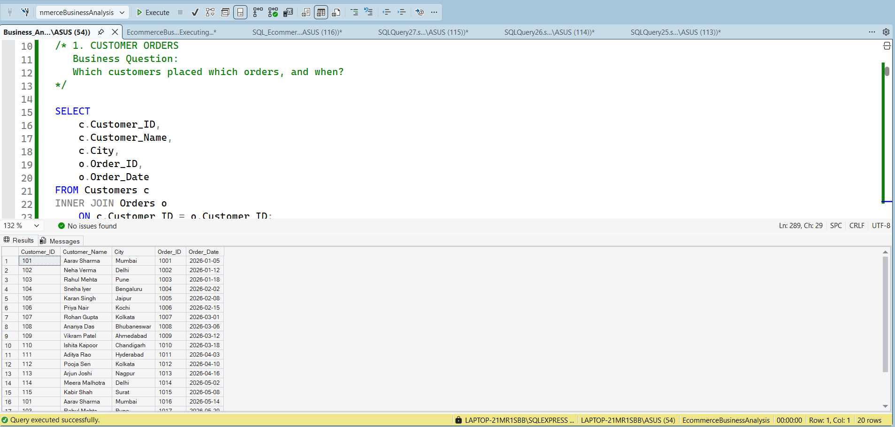
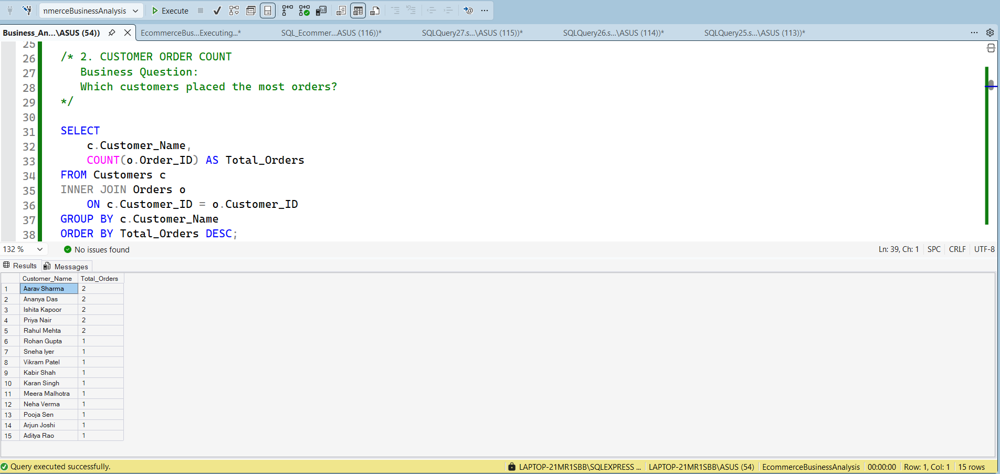
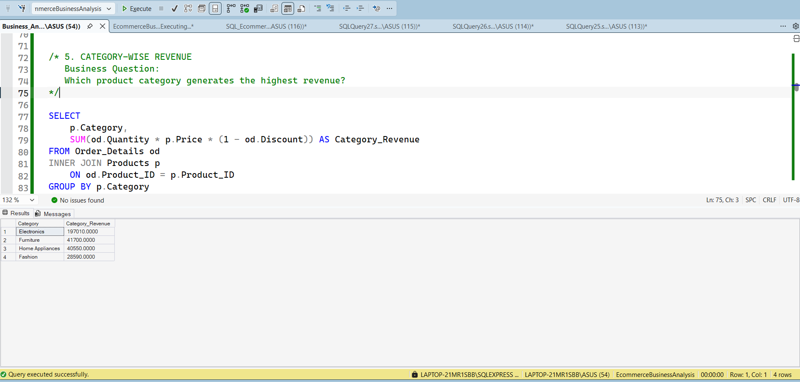
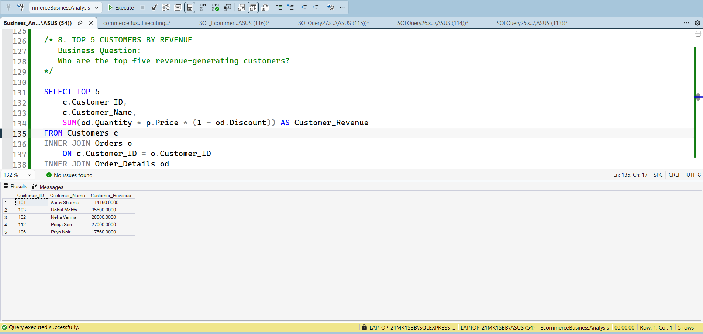

SQL E-Commerce Business Insights Analysis

Project Overview

This project analyzes e-commerce customer, order, product, and sales data using Microsoft SQL Server and SQL Server Management Studio (SSMS).

The objective is to apply SQL to real business questions such as customer purchasing behavior, revenue performance, category performance, regional sales, and top customer identification.

The project demonstrates the use of relational database design, JOINs, aggregate functions, GROUP BY, subqueries, and Common Table Expressions (CTEs).

Business Objectives

- Analyze customer ordering activity.
- Calculate total business revenue.
- Identify high-performing product categories.
- Analyze revenue performance by region.
- Identify top revenue-generating customers.
- Find products priced above the average product price.
- Identify customers generating above-average revenue.
- Apply CTEs and subqueries to solve business problems.

Database Structure

The project uses four related tables:

- `Customers`
- `Products`
- `Orders`
- `Order_Details`

Table Relationships

Customers → Orders → Order_Details ← Products

These tables are connected using Primary Key and Foreign Key relationships.

Tools & Technologies

- Microsoft SQL Server
- SQL Server Management Studio (SSMS)
- T-SQL
- GitHub

SQL Concepts Used

- SELECT
- WHERE
- ORDER BY
- Aggregate Functions
  - COUNT()
  - SUM()
  - AVG()
  - MAX()
  - MIN()
- GROUP BY
- INNER JOIN
- Multiple-table JOINs
- Subqueries
- Common Table Expressions (CTEs)
- TOP
- Calculated Revenue Expressions

Business Analysis Performed

Customer Order Analysis
Analyzed which customers placed orders and when.

2. Customer Order Count
Identified customers with the highest number of orders.

3. Category Revenue Analysis
Calculated category-wise revenue to identify the strongest product categories.

4. Top 5 Customers by Revenue
Identified the highest revenue-generating customers.

Key Business Insights

- Customer-level analysis helps identify repeat and high-value customers.
- Category-wise revenue analysis highlights which product groups contribute most to sales.
- Regional analysis can support geographic targeting and sales planning.
- Top-customer analysis can support customer retention and targeted marketing strategies.
- Subqueries and CTEs help solve more complex analytical requirements while keeping SQL logic structured.

Repository Contents

- `EcommerceBusinessAnalysis_Database.sql` – Database schema and sample data
- `Business_Analysis_Queries.sql` – SQL business analysis queries
- `01_Customer_Order_Analysis.png` – JOIN analysis output
- `02_Customer_Order_Count.png` – Customer order count output
- `03_Category_Revenue_Analysis.png` – Category revenue output
- `04_Top_5_Customers_By_Revenue.png` – Top customer analysis output
- `README.md` – Project documentation

Project Skills Demonstrated

This project demonstrates the ability to:

- Design and work with relational databases.
- Combine multiple tables using JOINs.
- Perform business-focused data analysis using SQL.
- Calculate and compare revenue across customers, products, categories, and regions.
- Use subqueries and CTEs for more advanced analysis.
- Translate business questions into SQL queries and actionable insights.

Author

Pranjal Gaud

Aspiring Data Analyst | Business Analyst  
SQL Server | Power BI | Excel | Business Analysis
